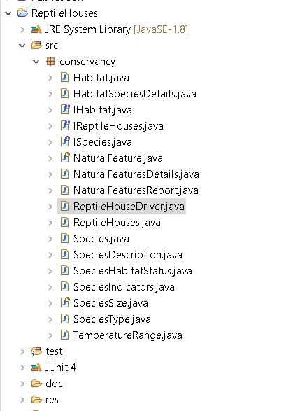
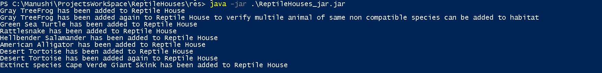
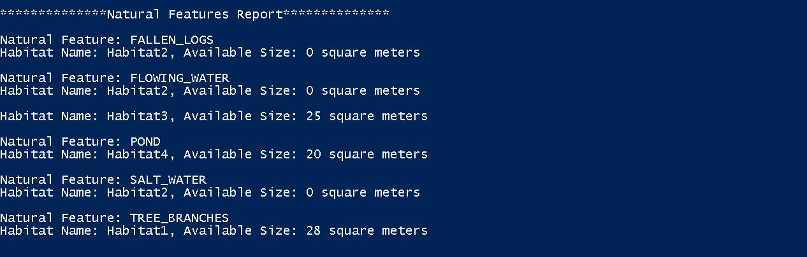
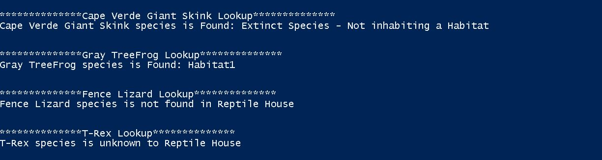
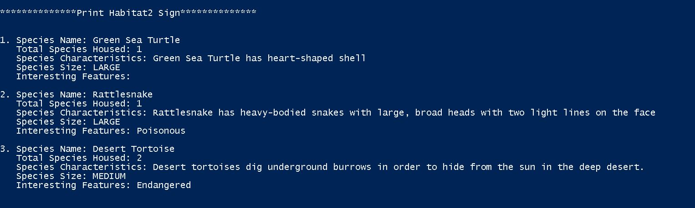
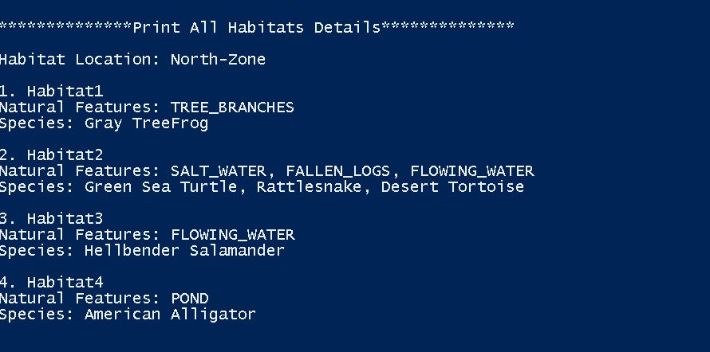
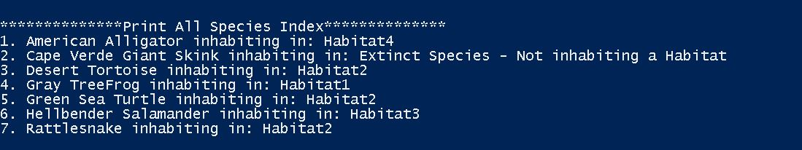

# Reptile House Tracking System

## Overview
Requirement is to design and implement a tracking system for Cold-Blooded Conservancy's reptile House which house reptiles and amphibians in a number of different habitats.

## List of features.
- New animals should be able to be brought into a Reptile House by adding them to an appropriate habitat using the following criteria:
    * There is a maximum of n habitats in the Reptile House (defined when the Reptile House is constructed) each of which can have up to 3 natural features that are added to make the residents feel at home.
    * A species can only be added into a habitat that has their preferred natural feature (though a feature can be added to the habitat if there is still space)
    * A species may inhabit multiple habitats
    * Any animal can be inserted into an empty habitat
    * Habitats can only house species with overlapping temperature ranges
    * The number of animals a habitat can host depends on the size of the habitat and the size of the animals in it. Small animals require 1 square meter, medium animals require 5 square meters, and large animals require 10 square meters.
    * No extinct species can be added to a habitat
    * Reptiles and amphibians cannot be mixed even if they can live with other species
- Report the natural features that are currently being used in alphabetical order. This list should include the habitat(s) where the natural feature is located and how much space is left in the habitat for additional animals measured in square meters.
- Look up which habitat(s) that house a particular species. If a species is found but not currently inhabiting a habitat, it should report this.
- Print a sign for any given habitat that lists the species that it houses along with a description of the species and an indicator of how many of that species is housed in that habitat. Each species description should include their name, their defining characteristics, as well as other interesting features (poisonous, extinct, endangered)
- Print a “map” that lists all the habitats by location and the natural features in the habitat and species they house.
- Print an index that lists all species in the Reptile House in alphabetical order and their location(s).

## How To Run. 

Conservancy package will have the below mentioned folder structure: 



- jar file is saved in the \res folder

- Open the \res folder in command shell

- run the command as below, program doesnt need any arguments from the user
 
```sh
> java -jar .\ReptileHouse.jar
```
 
 
                              

## How to Use the Program.
     
    There is no interaction with the user, so user just have to run the jar file as mentioned above
    
## Description of Example Runs

Results of running the ReptileHouses.jar file


```sh  
PS C:\Manushi\ProjectsWorkSpace\ReptileHouses\res> java -jar .\ReptileHouses_jar.jar
Gray TreeFrog has been added to Reptile House
Gray TreeFrog has been added again to Reptile House to verify multile animal of same non compatible species can be added to habitat
Green Sea Turtle has been added to Reptile House
Rattlesnake has been added to Reptile House
Hellbender Salamander has been added to Reptile House
American Alligator has been added to Reptile House
Desert Tortoise has been added to Reptile House
Desert Tortoise has been added again to Reptile House
Extinct species Cape Verde Giant Skink has been added to Reptile House

**************Natural Features Report**************

Natural Feature: FALLEN_LOGS
Habitat Name: Habitat2, Available Size: 0 square meters

Natural Feature: FLOWING_WATER
Habitat Name: Habitat2, Available Size: 0 square meters

Habitat Name: Habitat3, Available Size: 25 square meters

Natural Feature: POND
Habitat Name: Habitat4, Available Size: 20 square meters

Natural Feature: SALT_WATER
Habitat Name: Habitat2, Available Size: 0 square meters

Natural Feature: TREE_BRANCHES
Habitat Name: Habitat1, Available Size: 28 square meters


**************Cape Verde Giant Skink Lookup**************
Cape Verde Giant Skink species is Found: Extinct Species - Not inhabiting a Habitat


**************Gray TreeFrog Lookup**************
Gray TreeFrog species is Found: Habitat1


**************Fence Lizard Lookup**************
Fence Lizard species is not found in Reptile House


**************T-Rex Lookup**************
T-Rex species is unknown to Reptile House


**************Print Habitat2 Sign**************


1. Species Name: Green Sea Turtle
   Total Species Housed: 1
   Species Characteristics: Green Sea Turtle has heart-shaped shell
   Species Size: LARGE
   Interesting Features:

2. Species Name: Rattlesnake
   Total Species Housed: 1
   Species Characteristics: Rattlesnake has heavy-bodied snakes with large, broad heads with two light lines on the face
   Species Size: LARGE
   Interesting Features: Poisonous

3. Species Name: Desert Tortoise
   Total Species Housed: 2
   Species Characteristics: Desert tortoises dig underground burrows in order to hide from the sun in the deep desert.
   Species Size: MEDIUM
   Interesting Features: Endangered


**************Print All Habitats Details**************


1. Habitat1
Natural Features: TREE_BRANCHES
Species: Gray TreeFrog

2. Habitat2
Natural Features: SALT_WATER, FALLEN_LOGS, FLOWING_WATER
Species: Green Sea Turtle, Rattlesnake, Desert Tortoise

3. Habitat3
Natural Features: FLOWING_WATER
Species: Hellbender Salamander

4. Habitat4
Natural Features: POND
Species: American Alligator


**************Print All Species Index**************
1. American Alligator inhabiting in: Habitat4
2. Cape Verde Giant Skink inhabiting in: Extinct Species - Not inhabiting a Habitat
3. Desert Tortoise inhabiting in: Habitat2
4. Gray TreeFrog inhabiting in: Habitat1
5. Green Sea Turtle inhabiting in: Habitat2
6. Hellbender Salamander inhabiting in: Habitat3
7. Rattlesnake inhabiting in: Habitat2
```
## These are the ouputs for different requirements:
 
- New animals should be able to be brought into a Reptile House by adding them to an appropriate habitat
  
  
  
  
- Report the natural features that are currently being used in alphabetical order.
  
  
 
  
- Look up which habitat(s) that house a particular species. 
  
  
  
 
- Print a sign for any given habitat that lists the species that it houses along with a description of the species and an indicator of how many of that species is housed in that habitat. 
  
  
  
- Print a “map” that lists all the habitats by location and the natural features in the habitat and species they house.
  
  
  
  
- Print an index that lists all species in the Reptile House in alphabetical order and their location(s).
 
  
 
## Design/Model Changes

### - Version 2.0

#### IReptileHouse Interface:
Provides the Interface class to the user which exposes all the funcitonality/requirements APIs to the user (addSpecies, printHabitat map, ...).
    
Abstract conservancy class is removed since can't predict the common feature required for different additional houses.
    
#### ReptileHouses class:
It implements the IReptileHouse interface, interacts with the IHabitat interface to get/set habitat specific details (1 --> * relation) and uses ISpecies for getting the species related details (1 --> * relation).
    
##### IHabitat Interface:
Provides the skeleton for the Habitat class
    
Abstract Habitat  class is removed since can't predict the common feature required for different habitats.
    
##### Habitat class:
This class implements the IHabitat interface, like  addSpecies, addnaturalFeatures which were common to all habitats. This class interacts with the ISpecies interface to get/set species specific information (addSpecies to Habitat, get species compatibility,...) (1 --> * relation)
   
##### ISpecies Interface;
Provides the skeleton for the species APIs
   
Abstract Species  class is removed since can't predict the common feature required for different species.
   
##### Species class:
This class implements the ISpecies Interface which provides implementation specific to species.It provides methods required for habitat and Reptile house to implement the requirements.
   
##### HabitatSpeciesDetails:
This is supporting class maintains the details about the habitat's species. When the species are added to the habitat, habitat's characteristics changes like natural features, temperature range, remaining size of the habitat. This class is used to maintain all these details and will be used to set the habitat charecteristics, which is also reduces number of calls we do to the species class
   
There are other supporting class like SpeciesIndicators to maintain if species is (Poisonous, endangered, ..), SpeceisSize( small, medium, ..).
   
   
### - Version 1.0:
   
##### Convervancy Interface: 
Initially I have provided this Interface class to the user which exposes all the funcitonality/requirments APIs to the user (addSpecies, printHabitat map, ...).
   
##### Conservancy abstract class:
This abstract class implements the conservancy interface and provides the concrete class for all the APIS. Reptile house extends this abstract class. 
   
Idea behind this desgin was if in the future if there was a requirement for another bird conservancy or fish conservancy we can extend this class which has all the required APIS implemented.

##### Reptile House class:
This class extends the Conservancy abstract class which provides the implementation of all user APIs. This class only provides implementation specific to the resptile house.
   
##### Habitat Interface:
Provides the skeleton for the Habitat class
   
##### Abstract habitat class:
This class implements the habitat interface, like  addSpecies, addnaturalFeatures which were common to all habitats. 
Intuition of making this class abstract is to keep the common features of all habitat in one place and if there is any future requirement of adding warm blodded habitat we can use this class to get the common habitat implementation.
   
##### Coldbloddedhabitat:
This class extends the AbstractHabitat class which provides implementation specific to cold blodded habitat. 
   
##### Species Interface:
Provides the skeleton for the species APIs
   
##### Abstract Species class:
Implements the APIS needed for the species interface.
   
##### Coldblodded species:
This class extends the Abstractspecies class which provides implementation specific to cold blodded species.
   
There are another supporting classes which are used by other reptile, habitat and species concrete classes.
   
   
# ASSUMPTIONS
 
1) Habitat Size is fixed(i.e 30 sq mtrs)
2) Habitat name is in this format - "Habitat1", "Habitat2"
3) Habitat Temperature Range will be of the first species' Habitat Temperature Range(e.g 8 - 20 C) and if another species of Temperature Range (2 - 14C) or (10 - 22C) will not be added in the habitat since there Temperature Range is not within the habitat's temperature range (i.e 8 - 20C) 
4) Only Temperature Range between (0 - 50) are allowed.
  
# Limitations
 None

